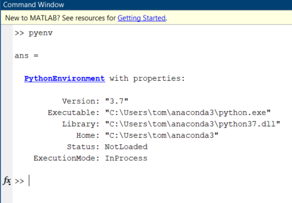
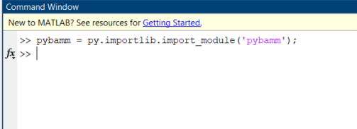
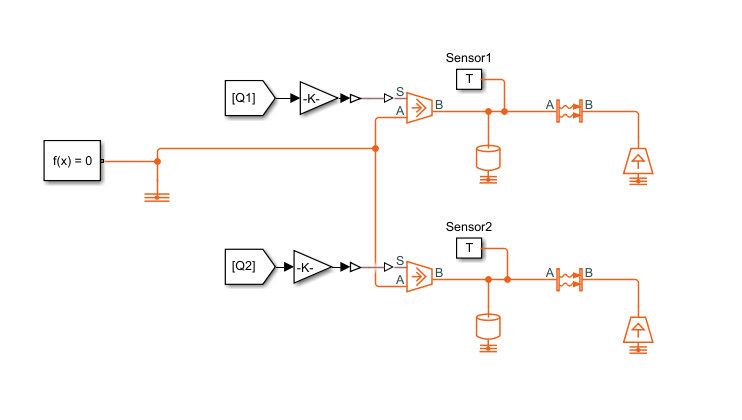
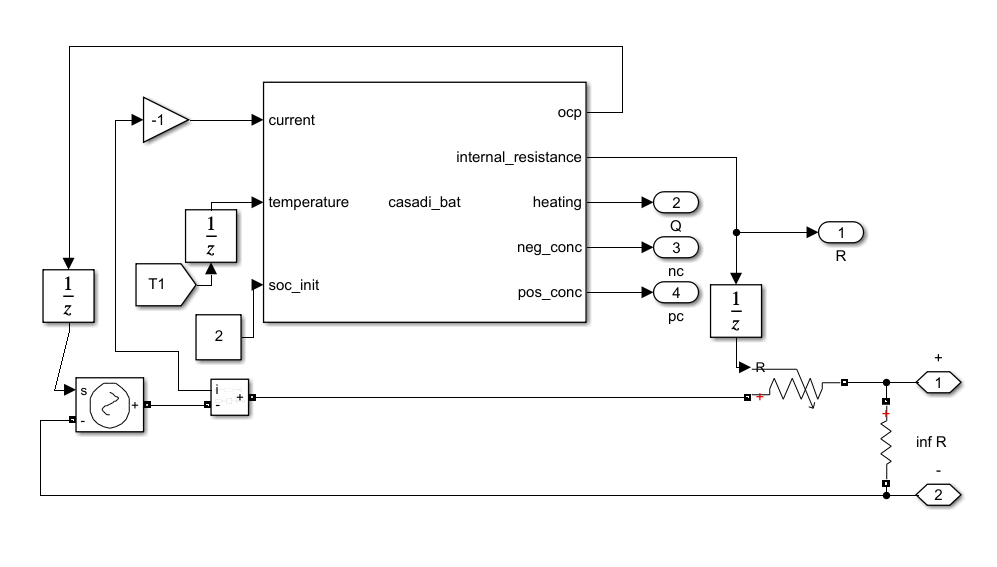
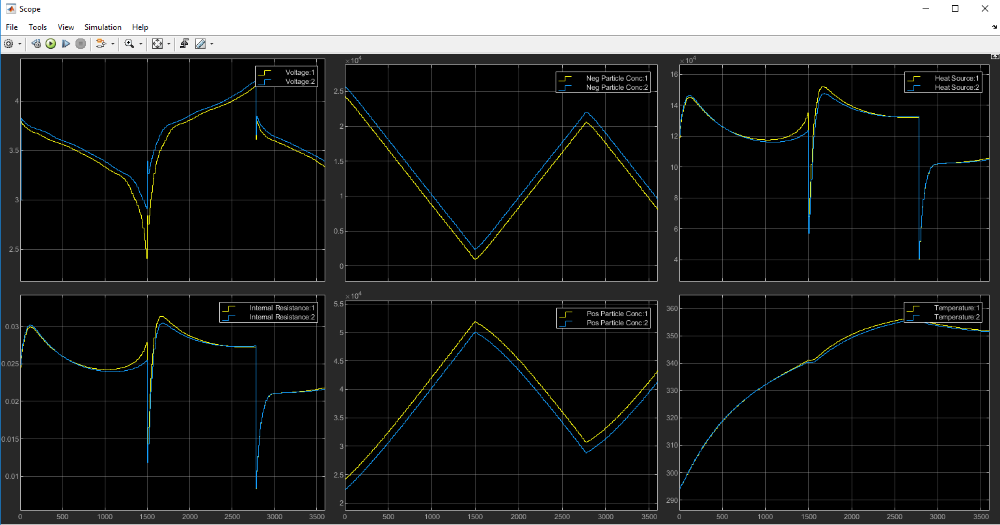

# PyBaMM Simulink integration example
How to run a PyBaMM battery model in Simulink for different pack configurations and coupled thermal problems.

Instructions for setting up the Simulink Battery Pack Model with python PyBaMM package (assumes Windows and MATLAB > 19b)

1) Download the latest Casadi for MATLAB https://web.casadi.org/get/ extract and save it somewhere to later add to your path in matlab. You will need to modify the matlab file run_pybamm_pack.m to point to the right directory. The default is 'C:\casadi-windows-matlabR2016a-v3.5.5'

2) Install a python distribution – a good option is Anaconda which works on all distributions and comes packaged with lots of useful libraries  and an environment manager https://www.anaconda.com/products/individual - choose the 64 bit version

3) From the start menu go to the Anaconda folder and open up an Anaconda command prompt

4) Navigate with command cd to the file path containing your matlab executable file e.g. cd C:\Program Files\MATLAB\R2020a\bin

5) Type matlab and press enter to open up matlab

6) Alternatively if you have a specific version of python you want to use on your machine or a specific environment in anaconda that you want to use you can edit your environment variables and add the directory where the python executable file is to your PATH

7) Type pyenv and this should show the details of your default (base) python environment

8) You can test that python is working in matlab by typing the following command py.list({'one', py.bool(0), 1}) and a list with different datatypes should be returned or py.help(‘len’) and it should return the help info on the python len function.

9) PyBaMM is available for install through the python package index and can be installed with command “pip install pybamm”. Alternatively you can download the source code from the github website https://github.com/pybamm-team/PyBaMM or use a git tool to create a local copy of a repository enabling you to manage switching between branches of the code and pull or push code to a specific branch. The best tool for this in windows is sourcetree https://www.sourcetreeapp.com/ and requires registering a github account https://github.com/. Once you have a local copy you can navigate to the folder on the Anaconda command prompt and type “pip install -e .” This only needs to be done once and just tells your python environment where to look for the pybamm code. Switching between branches afterwards updates the code but as python is not compiled no new install is required.

10)	To use a python module typically you would type “import <package>” e.g. “import numpy”. In matlab the syntax is a bit different as matlab doesn’t understand the import command you have to use the python import library function.

11)	Every line of python needs to be prefixed with “py.”. Instead of writing lots of python commands in a matlab script it is easier and quicker to write a python script that defines the model and saves some objects from the solver and then load them into matlab.

12)	The python script file can be run as a self-contained simulation itself and will replicate a number of steps that are taken in the Simulink model for a single battery. A parameter set from Chen2020 which was collected for an LG M50 21700 cylindrical Li-ion cell is used and modified. One of the key parameters, “Current function [A]”, is changed from being a constant to being an input parameter which means that its value can be changed throughout the simulation by a series of steps and updates. This is key to the Simulink integration which will solve the current throughout any electrical circuit and will change the value based on the current state of each battery.

13) A settings csv file contains the settings for both the python and matlab scripts. Any changes to the parameters and settings must be followed by running the python file to regenerate the casadi objects in the temp directory so that they can be read by matlab. The run_pybamm_pack.m script does this automatically at the start. N.B. making changes to the python script will not take effect in the matlab environment straight away. You need to restart matlab. Changing values in the settings will take immediate effect.

14)	The example Simulink model consists of 2 batteries in series connected via resistors representing the busbars and the welding contacts. An additional “infinite” resistor is also connected in parallel to overcome the open circuit condition on the model when the internal resistance of the batteries is undefined.

15) The thermal problem is also calculated in Simulink assuming a lumped independent heat loss for each battery with a prescribed heat transfer coefficient and common reference temperature. It would be possible to define these individually or couple them together for more complex cooling scenarios.

16)	Each battery is modelled as a subsystem consisting of a voltage source and a resistor.

17)	A matlab system block is used to control the running of the battery model code and is run using interpreted execution as it is not possible for Simulink to compile c-code from underlying python functions. It is also not possible for Simulink to infer the data types of the inputs and outputs when running python functions so these are specified in the source code too.

18)	Most of the source code lines are dealing with inputs and outputs but the important logic is contained within just 2 main functions: setupImpl and stepImpl. setupImpl is performed once in the simulation and loads the casadi integrator and variables functions generated by running the python file onto each battery system block. stepImpl is run during every timestep and calls the integrate function, saves the state of the battery for the next iteration and then calls the variables function and unpacks the data to evaluate the variables defined as outputs.

19) Opening and running the simulink file is possible after the run_pybamm_pack.m file is run which automatically calls the simulink simulation. Opening the scope lets you monitor the variables as they are calculated

